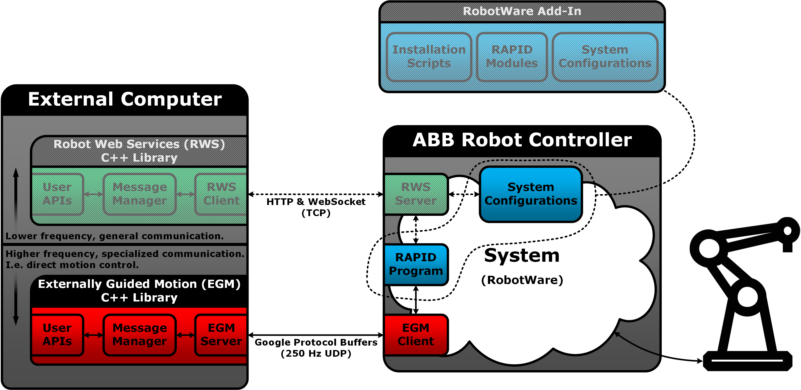
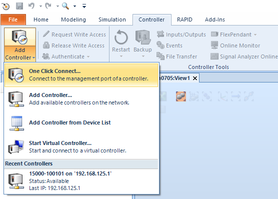
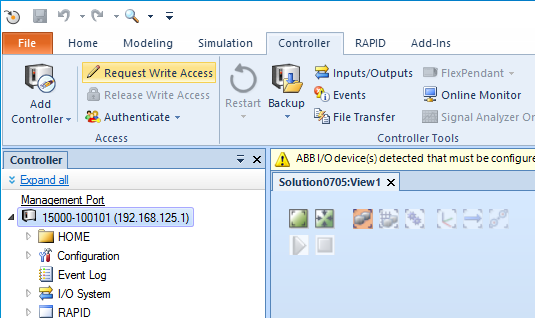
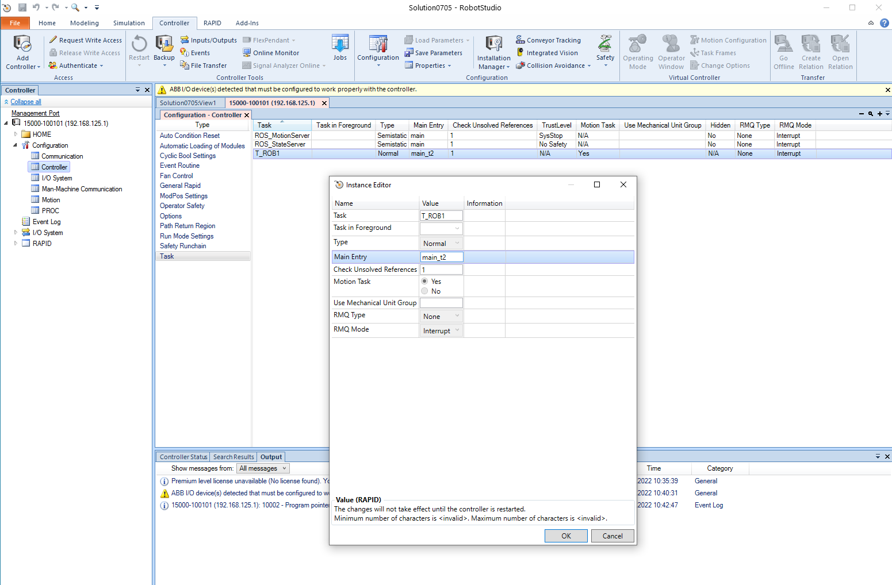
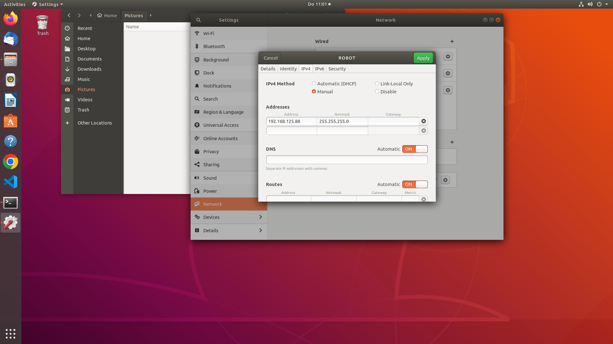

# gofa_libegm_samples

## Description
This ROS package provides some examples of controlling the robot GoFa via Externally Guided Motion (EGM). So far it includes following examples:
- src/a1_joint_trajectory_node.cpp
- src/a2_pose_trajectory_node.cpp
- src/c1_joint_controller_node.cpp
- src/c2_pose_controller_node.cpp



> The original sample codes can be found in [this issue](https://github.com/ros-industrial/abb_libegm/issues/18). 

> For more information regarding **abb_libegm**, click [here](https://github.com/ros-industrial/abb_libegm).

> For building the package without ROS, check the branch "cmake-branch", which provide a sample of how to call the functions in abb-libegm library. To check the plain cmake library of abb-libegm, click [here](https://github.com/jontje/abb_libegm/tree/plain_cmake_draft).


## Prerequisite
This package is tested with:

- [ ] Ubuntu 18.04 and ROS Melodic
- [ ] Ubuntu 20.04 and ROS Noetic

and built with [catkin_tools](https://catkin-tools.readthedocs.io/en/latest/index.html).


## Usage

### 1. Robotstuidio and ABB controller setup on WINDOWPC
a. access the controller in Robotstudio
- add controller to Robotstudio

    

    then click "log in as default user".
- request for access

    

and confirm on the FlexPendant.

b. change RAPID file

As shown in the above, to enable EGM, there should be a corresponding RAPID file running in the control box at the same time. The EGM communication sessions are started and stoped by RAPID instructions. To make sure the control box gets correct signals, the RAPID file needs to be inspected before running.

Go to *controller -> configuration -> controller -> task*, and double click the T_ROB1 task to open the configuration like this
    
- for joint space, use main_t1() as the main function
- for cartesain space, switch to main_t2()  

c. click restart to make sure all the changes have been updated 

### 2. ROS package usage on ROSPC
> First of all, make sure the ROSPC and Robotstudio are running under the same network.


a. Clone the repoistary to your local computer and build the package
```
mkdir -p catkin_ws/src
cd catkin_ws/src
git clone git@gitlab.lrz.de:jun.you/gofa_libegm_samples.git
cd ..
catkin build
source devel/setup.bash
```

b. Run package
- open a new terminal and run
``` 
roscore
```
- open a new terminal and run 
```
rosrun gofa_libegm_samples gofa_libegm_samples_a1_joint_trajectory_node 
```
to send command of multiple points in joint space at once.
Or
```
rosrun gofa_libegm_samples gofa_libegm_samples_a2_pose_trajectory_node 
```
to send command of multiple points in cartesian space at once. 
Or
```
rosrun gofa_libegm_samples gofa_libegm_samples_c1_joint_controller_node 
```
to send command of one point in joint space. 
Or
```
rosrun gofa_libegm_samples gofa_libegm_samples_c2_pose_controller_node 
```
to send command of one point in cartesian space. 


> Note: check the RAPID file in the controller to make sure that for each sample the corresponding RAPID file is running.


## Q&A
